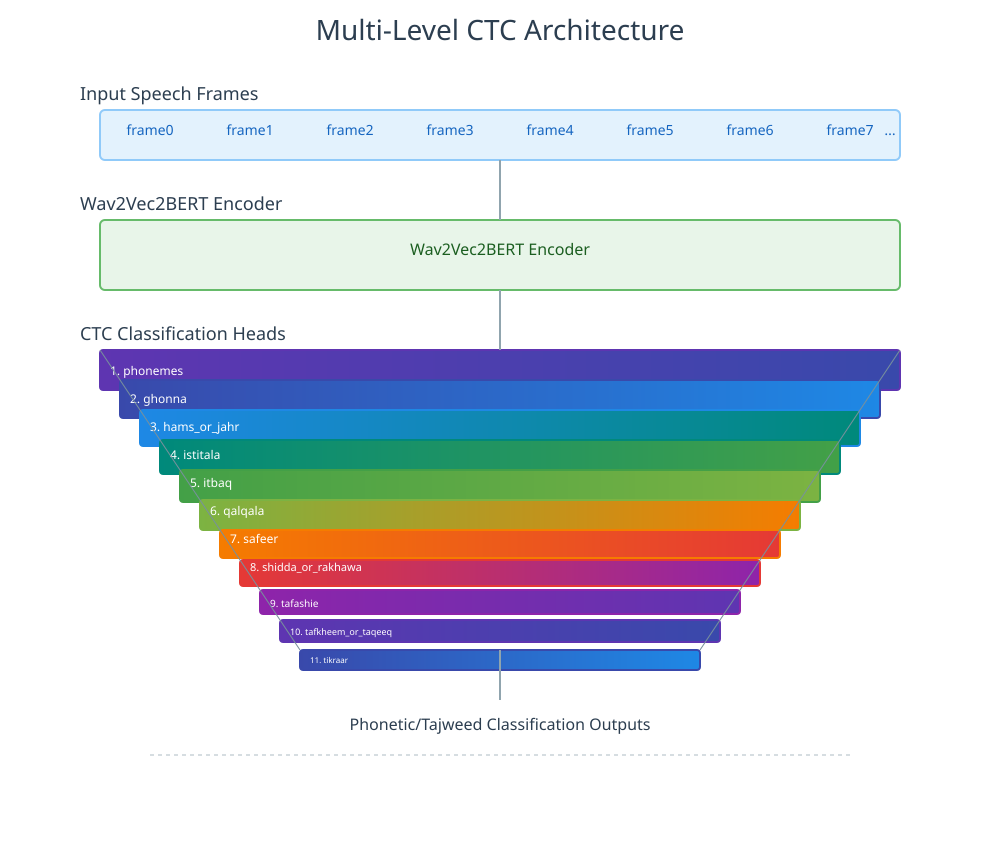

# Quran Muaalem

<div align="center">
<strong>Dengan izin Allah, kami hadirkan asisten cerdas untuk mendeteksi kesalahan bacaan, tajwid, dan sifat huruf Al-Qur'an.</strong>

[![PyPI][pypi-badge]][pypi-url]
[![Python Versions][python-badge]][python-url]
[![Hugging Face Model][hf-model-badge]][hf-model-url]
[![Hugging Face Dataset][hf-dataset-badge]][hf-dataset-url]
[![Google Colab][colab-badge]][colab-url]
[![arXiv][arxiv-badge]][arxiv-url]
[![MIT License][mit-badge]][mit-url]
[![Discord][discord-badge]][discord-url]

</div>

[pypi-badge]: https://img.shields.io/pypi/v/quran-muaalem.svg
[pypi-url]: https://pypi.org/project/quran-muaalem/
[mit-badge]: https://img.shields.io/github/license/obadx/quran-muaalem.svg
[mit-url]: https://github.com/obadx/quran-muaalem/blob/main/LICENSE
[python-badge]: https://img.shields.io/pypi/pyversions/quran-muaalem.svg
[python-url]: https://pypi.org/project/quran-muaalem/
[colab-badge]: https://img.shields.io/badge/Google%20Colab-Open%20in%20Colab-F9AB00?logo=google-colab&logoColor=white
[colab-url]: https://colab.research.google.com/drive/1If0G9NtdXiSRu6PVGtIMvLwxizF2jspn?usp=sharing
[hf-model-badge]: https://img.shields.io/badge/%F0%9F%A4%97%20Hugging%20Face-Model-blue
[hf-model-url]: https://huggingface.co/obadx/muaalem-model-v3_0
[hf-dataset-badge]: https://img.shields.io/badge/%F0%9F%A4%97%20Hugging%20Face-Dataset-orange
[hf-dataset-url]: https://huggingface.co/datasets/obadx/muaalem-annotated-v3
[arxiv-badge]: https://img.shields.io/badge/arXiv-Paper-<COLOR>.svg
[arxiv-url]: https://arxiv.org/abs/2509.00094
[discord-badge]: https://img.shields.io/badge/Discord-Join%20Community-7289da?logo=discord&logoColor=white
[discord-url]: https://discord.gg/hJWW6fCH

<div align="center" style="background-color: #f0f8ff; border-left: 5px solid #4CAF50; padding: 15px; margin: 20px 0; border-radius: 5px;">
  <h3 style="color: #2c3e50; margin-top: 0;">📖 Coba Pengajar Qur'an</h3>
  <p style="margin: 10px 0;">Klik untuk mencoba:</p>
  <a href="https://662a040e1863a5445c.gradio.live" style="display: inline-block; background-color: #4CAF50; color: white; padding: 10px 20px; text-decoration: none; border-radius: 5px; font-weight: bold; margin: 10px 0;">Buka Demo</a>
  <p style="background-color: #ffeb3b; padding: 8px; border-radius: 3px; display: inline-block; margin: 10px 0;">
    ⚠️ <strong>Catatan:</strong> tautan kedaluwarsa pada <span style="color: #d32f2f; font-weight: bold;">27 Agustus 2025</span>
  </p>
</div>

[](https://www.youtube.com/watch?v=CsFoznO08-Q)

## Fitur Utama

- Dilatih di atas skrip fonetik Al-Qur'an [quran-transcript](https://github.com/obadx/quran-transcript) untuk mendeteksi kesalahan huruf, tajwid, dan sifat huruf.
- Model ukuran sedang (~660M parameter).
- Hanya membutuhkan ~1.5 GB VRAM untuk inferensi.
- Arsitektur CTC multilevel yang inovatif.

## Arsitektur

Arsitektur CTC multilevel: tiap level belajar aspek berbeda.



## Alur Pengembangan Singkat

- Kumpulkan tilawah dari qari bersanad tinggi: [prepare-quran-dataset](https://github.com/obadx/prepare-quran-dataset)
- Segmentasi tilawah per waqaf (bukan per ayat) dengan [recitations-segmenter](https://github.com/obadx/recitations-segmenter)
- Ekstrak teks Qur'an dari audio memakai [Whisper Tarteel](https://huggingface.co/tarteel-ai/whisper-base-ar-quran)
- Koreksi teks dengan [algoritma tasmi’](https://github.com/obadx/quran-transcript)
- Ubah tulisan imlaiy ke Utsmani dan ke skrip fonetik tajwid: [quran-transcript](https://github.com/obadx/quran-transcript)
- Latih model dengan arsitektur [Wav2Vec2BERT](https://huggingface.co/docs/transformers/model_doc/wav2vec2-bert)

## Cara Menggunakan Model

### Melalui Gradio UI

Pasang [uv](https://docs.astral.sh/uv/):

```bash
pip install uv
```
atau
```bash
curl -LsSf https://astral.sh/uv/install.sh | sh
```

Pasang `ffmpeg`:

```bash
sudo apt-get update
sudo apt-get install -y ffmpeg
```

Atau lewat `conda`:
```bash
conda install ffmpeg
```

Jalankan UI Gradio (mengambil model dari Hugging Face):

```bash
uvx --no-cache --from https://github.com/obadx/quran-muaalem.git[ui] quran-muaalem-ui
```
atau
```bash
uvx quran-muaalem[ui] quran-muaalem-ui
```

### Melalui Python API

#### Instalasi

```bash
# Dependensi sistem
sudo apt-get install -y ffmpeg libsndfile1 portaudio19-dev

# Paket Python
pip install quran-muaalem librosa "numba>=0.61.2"
```

## Contoh Pemakaian Dasar

```python
"""
Contoh dasar penggunaan Quran Muaalem untuk analisis fonetik tilawah.
"""

from dataclasses import asdict
import json
import logging

from quran_transcript import Aya, quran_phonetizer, MoshafAttributes
import torch
from librosa.core import load

from quran_muaalem import Muaalem

logging.basicConfig(level=logging.INFO)

def analyze_recitation(audio_path):
    """
    Analisis bacaan Al-Qur'an menggunakan model Muaalem.
    """
    sampling_rate = 16000
    device = "cuda" if torch.cuda.is_available() else "cpu"

    uthmani_ref = Aya(8, 75).get_by_imlaey_words(17, 9).uthmani
    moshaf = MoshafAttributes(
        rewaya="hafs",
        madd_monfasel_len=2,
        madd_mottasel_len=4,
        madd_mottasel_waqf=4,
        madd_aared_len=2,
    )

    phonetizer_out = quran_phonetizer(uthmani_ref, moshaf, remove_spaces=True)
    muaalem = Muaalem(device=device)
    wave, _ = load(audio_path, sr=sampling_rate, mono=True)

    outs = muaalem([wave], [phonetizer_out], sampling_rate=sampling_rate)

    for out in outs:
        print("Predicted Phonemes:", out.phonemes.text)
        for sifa in out.sifat:
            print(json.dumps(asdict(sifa), indent=2, ensure_ascii=False))
            print("*" * 30)
        print("-" * 40)

    explain_for_terminal(
        outs[0].phonemes.text,
        phonetizer_out.phonemes,
        outs[0].sifat,
        phonetizer_out.sifat,
    )


if __name__ == "__main__":
    audio_path = "./assets/test.wav"
    try:
        analyze_recitation(audio_path)
    except Exception as e:
        logging.error(f"Error processing audio: {e}")
```

Contoh keluaran (dari terminal):

```bash
ءِننننَللَااهَبِكُللِشَيءِنعَلِۦۦمُ۾۾۾بَرَااااءَتُممممِنَللَااهِوَرَسُۥۥلِه
┏━━━━━━━━━━┳━━━━━━━━━━━━━━━━┳━━━━━━━━━━━━━━┳━━━━━━━━━━━━━━┳━━━━━━━━━━━━━━┳━━━━━━━━━━━┳━━━━━━━━━━━━━┳━━━━━━━━━━━━━━━━━━━━┳━━━━━━━━━━━━━━━┳━━━━━━━━━━━━━━━━━━━┳━━━━━━━━━━┓
┃ Phonemes ┃ Tafashie       ┃ Qalqla       ┃ Ghonna       ┃ Hams Or Jahr ┃ Safeer    ┃ Tikraar     ┃ Tafkheem Or Taqeeq ┃ Istitala      ┃ Shidda Or Rakhawa ┃ Itbaq    ┃
┡━━━━━━━━━━╇━━━━━━━━━━━━━━━━╇━━━━━━━━━━━━━━╇━━━━━━━━━━━━━━╇━━━━━━━━━━━━━━╇━━━━━━━━━━━╇━━━━━━━━━━━━━╇━━━━━━━━━━━━━━━━━━━━╇━━━━━━━━━━━━━━━╇━━━━━━━━━━━━━━━━━━━╇━━━━━━━━━━┩
│ ءِ        │ not_motafashie │ not_moqalqal │ not_maghnoon │ jahr         │ no_safeer │ not_mokarar │ moraqaq            │ not_mostateel │ shadeed           │ monfateh │
│ ننننَ     │ not_motafashie │ not_moqalqal │ maghnoon     │ jahr         │ no_safeer │ not_mokarar │ moraqaq            │ not_mostateel │ between           │ monfateh │
│ للَ       │ not_motafashie │ not_moqalqal │ not_maghnoon │ jahr         │ no_safeer │ not_mokarar │ mofakham           │ not_mostateel │ between           │ monfateh │
│ اا       │ not_motafashie │ not_moqalqal │ not_maghnoon │ jahr         │ no_safeer │ not_mokarar │ mofakham           │ not_mostateel │ rikhw             │ monfateh │
│ هَ        │ not_motafashie │ not_moqalqal │ not_maghnoon │ hams         │ no_safeer │ not_mokarar │ moraqaq            │ not_mostateel │ rikhw             │ monfateh │
│ بِ        │ not_motafashie │ not_moqalqal │ not_maghnoon │ jahr         │ no_safeer │ not_mokarar │ moraqaq            │ not_mostateel │ shadeed           │ monfateh │
│ كُ        │ not_motafashie │ not_moqalqal │ not_maghnoon │ hams         │ no_safeer │ not_mokarar │ moraqaq            │ not_mostateel │ shadeed           │ monfateh │
│ للِ       │ not_motafashie │ not_moqalqal │ not_maghnoon │ jahr         │ no_safeer │ not_mokarar │ moraqaq            │ not_mostateel │ between           │ monfateh │
│ شَ        │ motafashie     │ not_moqalqal │ not_maghnoon │ hams         │ no_safeer │ not_mokarar │ moraqaq            │ not_mostateel │ rikhw             │ monfateh │
│ ي        │ not_motafashie │ not_moqalqal │ not_maghnoon │ jahr         │ no_safeer │ not_mokarar │ moraqaq            │ not_mostateel │ rikhw             │ monfateh │
│ ءِ        │ not_motafashie │ not_moqalqal │ not_maghnoon │ jahr         │ no_safeer │ not_mokarar │ moraqaq            │ not_mostateel │ shadeed           │ monfateh │
│ ن        │ not_motafashie │ not_moqalqal │ maghnoon     │ jahr         │ no_safeer │ not_mokarar │ moraqaq            │ not_mostateel │ between           │ monfateh │
│ عَ        │ not_motafashie │ not_moqalqal │ not_maghnoon │ jahr         │ no_safeer │ not_mokarar │ moraqaq            │ not_mostateel │ between           │ monfateh │
│ لِ        │ not_motafashie │ not_moqalqal │ not_maghnoon │ jahr         │ no_safeer │ not_mokarar │ moraqaq            │ not_mostateel │ between           │ monfateh │
│ ۦۦ       │ not_motafashie │ not_moqalqal │ not_maghnoon │ jahr         │ no_safeer │ not_mokarar │ moraqaq            │ not_mostateel │ rikhw             │ monfateh │
│ مُ        │ not_motafashie │ not_moqalqal │ maghnoon     │ jahr         │ no_safeer │ not_mokarar │ moraqaq            │ not_mostateel │ between           │ monfateh │
│ ۾۾۾      │ not_motafashie │ not_moqalqal │ maghnoon     │ jahr         │ no_safeer │ not_mokarar │ moraqaq            │ not_mostateel │ rikhw             │ monfateh │
│ بَ        │ not_motafashie │ not_moqalqal │ not_maghnoon │ jahr         │ no_safeer │ not_mokarar │ moraqaq            │ not_mostateel │ shadeed           │ monfateh │
│ رَ        │ not_motafashie │ not_moqalqal │ not_maghnoon │ jahr         │ no_safeer │ mokarar     │ mofakham           │ not_mostateel │ between           │ monfateh │
│ اااا     │ not_motafashie │ not_moqalqal │ not_maghnoon │ jahr         │ no_safeer │ not_mokarar │ mofakham           │ not_mostateel │ rikhw             │ monfateh │
│ ءَ        │ not_motafashie │ not_moqalqal │ not_maghnoon │ jahr         │ no_safeer │ not_mokarar │ moraqaq            │ not_mostateel │ shadeed           │ monfateh │
│ تُ        │ not_motafashie │ not_moqalqal │ not_maghnoon │ hams         │ no_safeer │ not_mokarar │ moraqaq            │ not_mostateel │ shadeed           │ monfateh │
│ ممممِ     │ not_motafashie │ not_moqalqal │ maghnoon     │ jahr         │ no_safeer │ not_mokarar │ moraqaq            │ not_mostateel │ between           │ monfateh │
│ نَ        │ not_motafashie │ not_moqalqal │ maghnoon     │ jahr         │ no_safeer │ not_mokarar │ moraqaq            │ not_mostateel │ between           │ monfateh │
│ للَ       │ not_motafashie │ not_moqalqal │ not_maghnoon │ jahr         │ no_safeer │ not_mokarar │ mofakham           │ not_mostateel │ between           │ monfateh │
│ اا       │ not_motafashie │ not_moqalqal │ not_maghnoon │ jahr         │ no_safeer │ not_mokarar │ mofakham           │ not_mostateel │ rikhw             │ monfateh │
│ هِ        │ not_motafashie │ not_moqalqal │ not_maghnoon │ hams         │ no_safeer │ not_mokarar │ moraqaq            │ not_mostateel │ rikhw             │ monfateh │
│ وَ        │ not_motafashie │ not_moqalqal │ not_maghnoon │ jahr         │ no_safeer │ not_mokarar │ moraqaq            │ not_mostateel │ rikhw             │ monfateh │
│ رَ        │ not_motafashie │ not_moqalqal │ not_maghnoon │ jahr         │ no_safeer │ mokarar     │ mofakham           │ not_mostateel │ between           │ monfateh │
│ سُ        │ not_motafashie │ not_moqalqal │ not_maghnoon │ hams         │ safeer    │ not_mokarar │ moraqaq            │ not_mostateel │ rikhw             │ monfateh │
│ ۥۥ       │ not_motafashie │ not_moqalqal │ not_maghnoon │ jahr         │ no_safeer │ not_mokarar │ moraqaq            │ not_mostateel │ rikhw             │ monfateh │
│ لِ        │ not_motafashie │ not_moqalqal │ not_maghnoon │ jahr         │ no_safeer │ not_mokarar │ moraqaq            │ not_mostateel │ between           │ monfateh │
│ ه        │ not_motafashie │ not_moqalqal │ not_maghnoon │ hams         │ no_safeer │ not_mokarar │ moraqaq            │ not_mostateel │ rikhw             │ monfateh │
└──────────┴────────────────┴──────────────┴──────────────┴──────────────┴───────────┴─────────────┴────────────────────┴───────────────┴───────────────────┴──────────┘
```

### API Docs (ringkas)

```python
class Muaalem:
    def __init__(
        self,
        model_name_or_path: str = "obadx/muaalem-model-v3_2",
        device: str = "cpu",
        dtype=torch.bfloat16,
    ):
        """
        Inisialisasi model Muaalem.

        Args:
            model_name_or_path: nama atau path model di Hugging Face
            device: CPU/GPU untuk inferensi
            dtype: tipe data torch (default bfloat16 sesuai pelatihan)
        """

    @torch.no_grad()
    def __call__(
        self,
        waves: list[list[float] | torch.FloatTensor | NDArray],
        ref_quran_phonetic_script_list: list[QuranPhoneticScriptOutput],
        sampling_rate: int,
    ) -> list[MuaalemOutput]:
        """
        Fungsi inferensi.

        waves: batch sinyal audio
        ref_quran_phonetic_script_list: output fonetizer `quran_phonetizer` dengan remove_space=True
        sampling_rate: harus 16000

        Mengembalikan list MuaalemOutput yang memuat fonem dan sifat huruf.
        """
```
